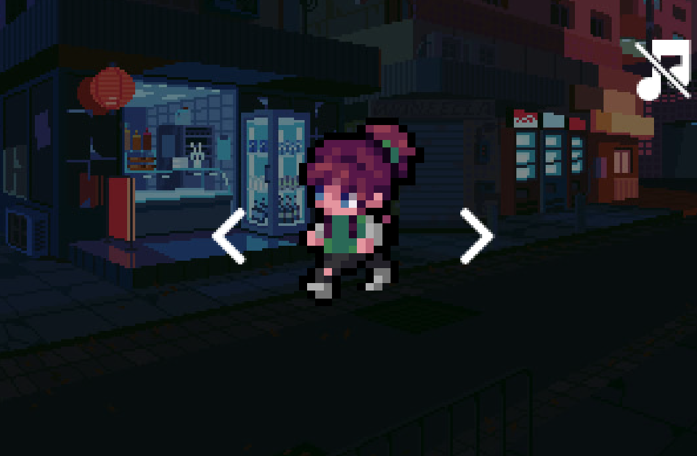

# TP1 - Scène réactive
Cette scène réactive représente un menu d'édition de personnage. L'objectif est de faire fonctionner les fonctions de base de Godot. 

## Touches
- Espace : Permet d'activer/désactiver la musique.
- Souris (click droit) : Cliquer sur les flèches pour faire tourner le personnage, cliquer sur l'icone musique pour activer/désactiver la musique.
